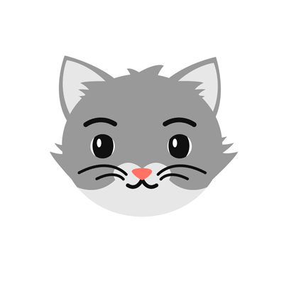

<h1 align="center">Hello Mate, I'm Vignesh </h1>
<h3 align="center">| CODER | WEB DEVELOPER | SELF-LEARNER |</h3>

I am a pre-final year CS student with a great passion for programming. I am trying to create magic with 0's and 1's.I have experimented with HTML, CSS, PHP etc and done some some personal projects on them u can see on my Repository.

- 📫 How to reach me **vigneshmanyala0@gmail.com**

  

###  A little more about me...  

- 🔭 I’m currently working on **Match Making**

- 🌱 I’m currently learning **Competitive programming**

- 👨‍💻 All of my projects are available at [https://github.com/vigneshmanyala](https://github.com/vigneshmanyala)

- 📫 How to reach me **vigneshmanyala0@gmail.com**

<h3 align="left">Connect with me:</h3>

<h3 align="left">Languages and Tools:</h3>

           

 <em><b>I love connecting with people</b> so if you want to say <b>hi, I'll be happy to meet you more!</b> 😊</em>

  

 
  

